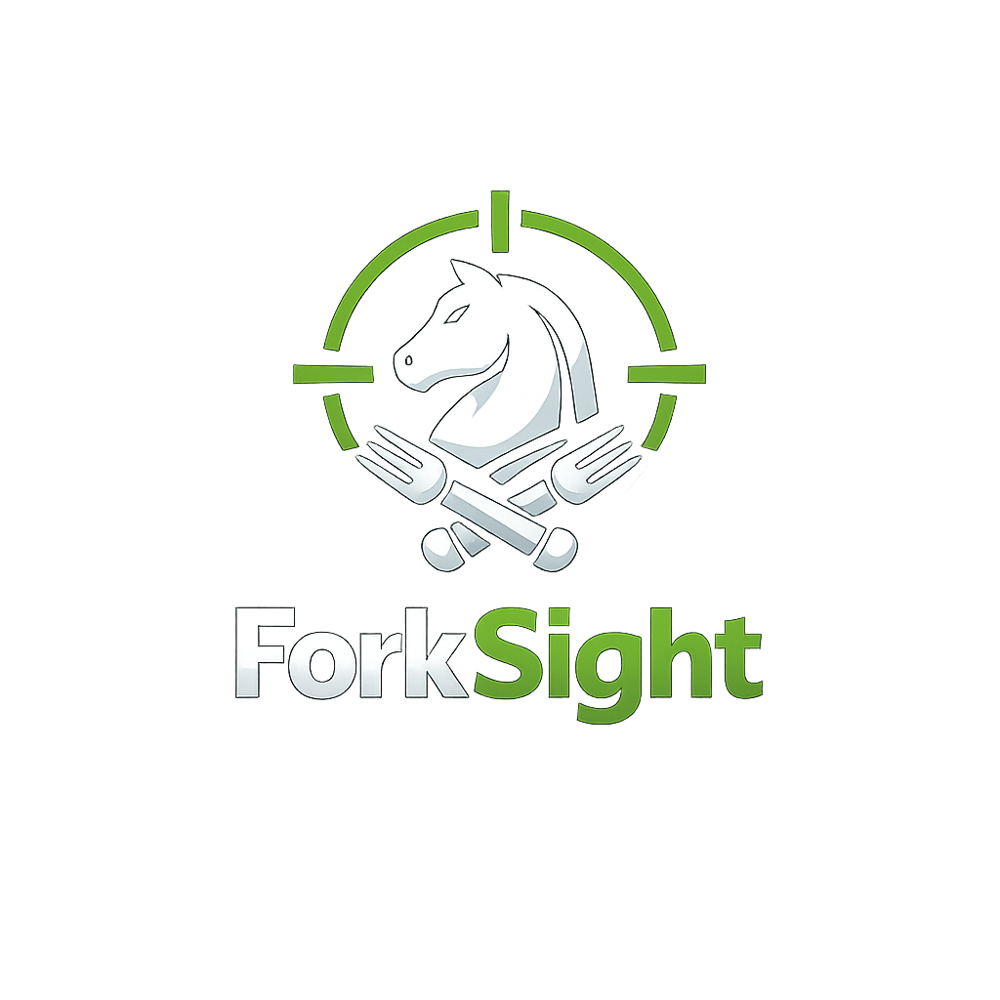
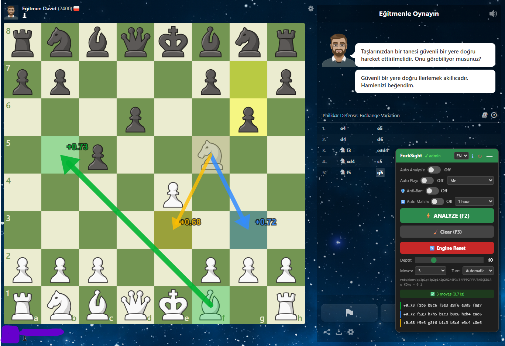
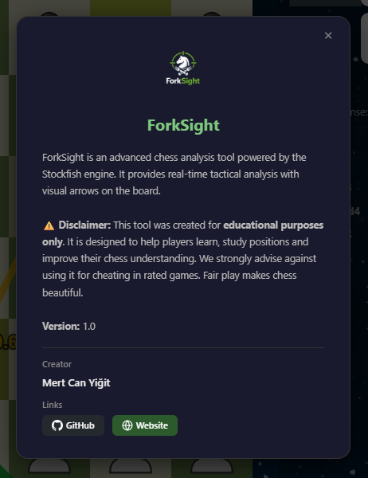
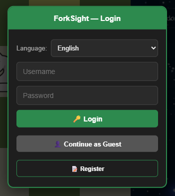
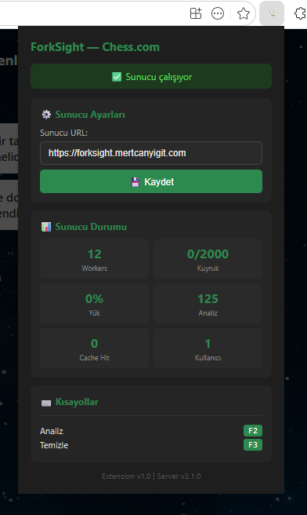

  

<h1 align="center">ForkSight</h1>

  <strong>Real-Time Chess Analysis Powered by Stockfish</strong>

  
  
  
  
  

  <a href="#-features">Features</a> •
  <a href="#-installation">Installation</a> •
  <a href="#-free-vs-premium">Free vs Premium</a> •
  <a href="#-screenshots">Screenshots</a> •
  <a href="#-support-the-project">Donate</a> •
  <a href="#-contact">Contact</a>

---

## 🎯 What is ForkSight?

**ForkSight** is a powerful Chrome extension that brings **professional-grade Stockfish analysis** directly into your browser while you play on **Chess.com** and **Lichess.org**. It overlays real-time tactical insights on the board with color-coded arrows, helping you study positions, understand best moves, and improve your chess skills.

> ⚠️ **Educational Use Only** — ForkSight was built as a learning and study tool. We strongly discourage using it in rated games. Fair play keeps chess beautiful. ♟️

### Why ForkSight?

|                      | Traditional Analysis | ForkSight                         |
| -------------------- | -------------------- | --------------------------------- |
| 🕐 **Speed**         | Post-game only       | Real-time, during play            |
| 🎨 **Visualization** | Text-based PGN       | Color-coded arrows on board       |
| 📊 **Depth**         | Limited free tiers   | Up to depth 25 with Stockfish 16+ |
| 🌐 **Platform**      | Single site          | Chess.com + Lichess.org           |
| 🌍 **Language**      | English only         | English, Türkçe, Deutsch          |

---

## ✨ Features

<table>
<tr>
<td width="50%">

### 🔍 Smart Analysis

- **Stockfish 16+** engine on cloud servers
- Adjustable depth (5–25)
- Multi-PV support (up to 5 best lines)
- Color-coded arrows with move ranking
- Source & destination square highlights

</td>
<td width="50%">

### 🎮 Board Integration

- Seamless overlay on Chess.com & Lichess
- Automatic board detection & orientation
- Works with all time controls
- Keyboard shortcuts (**F2** analyze, **F3** clear)
- Draggable, minimizable floating panel

</td>
</tr>
<tr>
<td>

### 🌐 Multi-Language

- 🇬🇧 English
- 🇹🇷 Türkçe
- 🇩🇪 Deutsch
- Switch language on-the-fly from the panel

</td>
<td>

### 🔒 Secure Architecture

- Encrypted HTTPS communication
- JWT-based authentication
- WebSocket real-time connection
- No data stored on your device
- Secure cloud-hosted engine

</td>
</tr>
</table>

### Premium-Only Features

| Feature                | Description                                                  |
| ---------------------- | ------------------------------------------------------------ |
| 🤖 **Auto Analysis**   | Automatically analyzes every position as the game progresses |
| 🎯 **Auto Play**       | Plays the best move automatically on your behalf             |
| 🛡️ **Anti-Ban System** | Intelligent behavior patterns to maintain natural play style |
| 🔄 **Auto Match**      | Automatically queues and starts new games (10m to unlimited) |
| ⚡ **High Depth**      | Analyze up to depth 25 (Free: max 8)                         |
| 📊 **Multi-PV**        | See up to 5 best lines simultaneously (Free: 1 line)         |
| 🔄 **Engine Reset**    | Reset the analysis engine on demand                          |
| ⚡ **WebSocket**       | Real-time streaming analysis with live depth updates         |

---

## 📦 Installation

### Step 1 — Download

Download the latest release from the [**Releases**](../../releases) page:

- `forksight-chesscom-v1.0.zip` — for **Chess.com**
- `forksight-lichess-v1.0.zip` — for **Lichess.org**

### Step 2 — Install in Chrome

1. Unzip the downloaded file
2. Open Chrome and navigate to `chrome://extensions/`
3. Enable **Developer Mode** (toggle in the top-right corner)
4. Click **"Load unpacked"**
5. Select the unzipped extension folder
6. The ForkSight icon will appear in your toolbar ✅

### Step 3 — Start Using

1. Go to [chess.com](https://www.chess.com) or [lichess.org](https://lichess.org)
2. The ForkSight panel will appear on the page
3. **Free users**: Log in as Guest to start analyzing
4. **Premium users**: Log in with your credentials for full access

---

## 💎 Free vs Premium

<table>
<thead>
<tr>
<th align="left">Feature</th>
<th align="center">🆓 Free (Guest)</th>
<th align="center">💎 Premium</th>
</tr>
</thead>
<tbody>
<tr>
<td>Manual Analysis (F2)</td>
<td align="center">✅</td>
<td align="center">✅</td>
</tr>
<tr>
<td>Arrow Visualization</td>
<td align="center">✅</td>
<td align="center">✅</td>
</tr>
<tr>
<td>Chess.com Support</td>
<td align="center">✅</td>
<td align="center">✅</td>
</tr>
<tr>
<td>Lichess Support</td>
<td align="center">✅</td>
<td align="center">✅</td>
</tr>
<tr>
<td>Multi-Language</td>
<td align="center">✅</td>
<td align="center">✅</td>
</tr>
<tr>
<td>Analysis Depth</td>
<td align="center">Max <strong>8</strong></td>
<td align="center">Max <strong>25</strong></td>
</tr>
<tr>
<td>Best Lines (Multi-PV)</td>
<td align="center"><strong>1</strong> line</td>
<td align="center">Up to <strong>5</strong> lines</td>
</tr>
<tr>
<td>Auto Analysis</td>
<td align="center">❌</td>
<td align="center">✅</td>
</tr>
<tr>
<td>Auto Play</td>
<td align="center">❌</td>
<td align="center">✅</td>
</tr>
<tr>
<td>Anti-Ban System</td>
<td align="center">❌</td>
<td align="center">✅</td>
</tr>
<tr>
<td>Auto Match</td>
<td align="center">❌</td>
<td align="center">✅</td>
</tr>
<tr>
<td>Engine Reset</td>
<td align="center">❌</td>
<td align="center">✅</td>
</tr>
<tr>
<td>WebSocket Streaming</td>
<td align="center">❌</td>
<td align="center">✅</td>
</tr>
<tr>
<td>Priority Support</td>
<td align="center">❌</td>
<td align="center">✅</td>
</tr>
</tbody>
</table>

> 🔑 **Want Premium?** Starting at just **$2.99/month** or **$19.99 lifetime** via [GitHub Sponsors](https://github.com/sponsors/mrtcnygt0). Your account will be upgraded within 24 hours!

---

## 📸 Screenshots

<table>
<tr>
<td align="center" width="50%">
 
<strong>Analysis Panel</strong> 
<em>Real-time Stockfish analysis with color-coded arrows</em>
</td>
<td align="center" width="50%">
 
<strong>About Dialog</strong> 
<em>Project information and creator details</em>
</td>
</tr>
<tr>
<td align="center">
 
<strong>Login Screen</strong> 
<em>Secure authentication with guest mode option</em>
</td>
<td align="center">
 
<strong>Extension Popup</strong> 
<em>Server status and quick settings</em>
</td>
</tr>
</table>

---

## ⌨️ Keyboard Shortcuts

| Shortcut | Action                    |
| -------- | ------------------------- |
| `F2`     | Analyze current position  |
| `F3`     | Clear arrows and analysis |

---

## 🌍 Supported Platforms

| Platform                                                                                                                                                                                                                                                                                                                                                                                                                                    | Status             | Extension            |
| ------------------------------------------------------------------------------------------------------------------------------------------------------------------------------------------------------------------------------------------------------------------------------------------------------------------------------------------------------------------------------------------------------------------------------------------- | ------------------ | -------------------- |
|  | ✅ Fully Supported | `extension/`         |
|                                                                                                                                                                                                                                                                                                                                  | ✅ Fully Supported | `lichess-extension/` |

---

## 💖 Support the Project

  

ForkSight is maintained by a solo developer. Running cloud servers and the Stockfish engine 24/7 requires real resources. **Your donations keep ForkSight alive and help bring new features to life.**

If ForkSight has helped you learn or enjoy chess more, please consider supporting the project:

  

> Every contribution, no matter how small, makes a real difference. Thank you! 🙏

**What your donations fund:**

- ☁️ Cloud server costs (24/7 Stockfish engine hosting)
- 🔧 Ongoing development & new features
- 🐛 Bug fixes and platform compatibility updates
- 🌍 New language translations
- 📱 Future mobile & Firefox support

---

## 📬 Contact

**Want to get Premium access?** Choose your plan and sponsor us on GitHub:

| Plan            | Price                 |                                  |
| --------------- | --------------------- | -------------------------------- |
| 📅 **Monthly**  | **$2.99/mo** (₺99/ay) | Cancel anytime                   |
| ♾️ **Lifetime** | **$19.99** (₺799)     | One-time payment, forever access |

  

After sponsoring, send your **ForkSight username** to activate Premium:

| Channel        | Link                                                            |
| -------------- | --------------------------------------------------------------- |
| 📧 **Email**   | [mertcanyigit54@outlook.com](mailto:mertcanyigit54@outlook.com) |
| 🌐 **Website** | [mertcanyigit.com](https://mertcanyigit.com)                    |
| 🐙 **GitHub**  | [github.com/mrtcnygt0](https://github.com/mrtcnygt0)            |

---

## ⚖️ License

**© 2026 Mert Can Yiğit. All Rights Reserved.**

This software is proprietary and protected by copyright law. See the [LICENSE](LICENSE) file for full details.

> ⛔ **You may NOT** modify, redistribute, reverse-engineer, or create derivative works from this software.
>
> ✅ **You MAY** use ForkSight for personal, educational purposes within the terms of the license.

---

## ⚠️ Disclaimer

ForkSight is an **educational tool** designed for studying chess positions and improving your understanding of the game. The developers do not encourage or condone the use of this software for cheating in online rated games. Use of this tool in violation of any platform's terms of service is solely the user's responsibility.

---

  
   
  <strong>ForkSight</strong> — See every fork. Seize every tactic.
   
  Made with ♟️ by <a href="https://mertcanyigit.com">Mert Can Yiğit</a>

