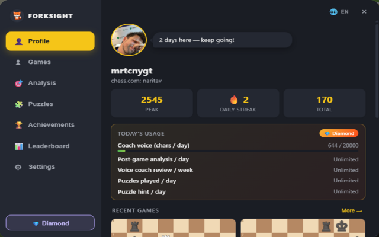
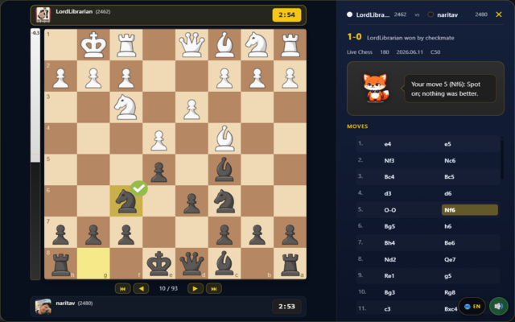
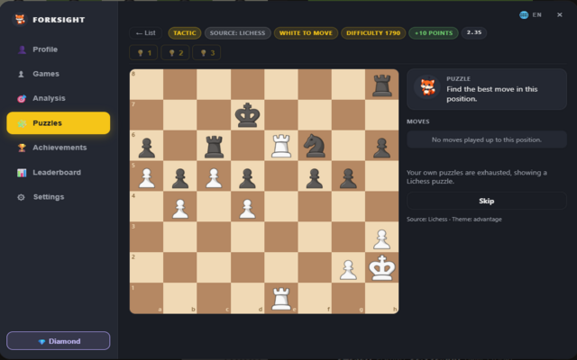
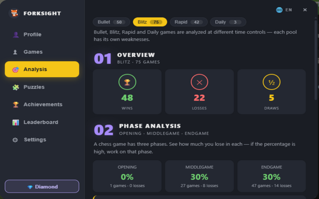
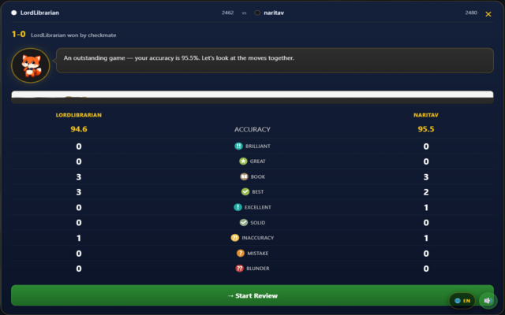

  

<h1 align="center">ForkSight — Chess.com Training & Coaching Extension</h1>

  Unofficial training companion for Chess.com with puzzle practice,
  post-game coach review, profile stats, and optional Premium tiers.

  <a href="https://forksight.net">Website</a> ·
  <a href="https://forksight.net/premium">Premium</a> ·
  <a href="https://forksight.net/privacy">Privacy Policy</a>

## Overview

ForkSight is a Chrome extension built for post-game improvement workflows on Chess.com.

Core goals:

- Turn played games into actionable learning.
- Provide puzzle and hint flows tied to your own games.
- Offer clear, profile-based progress tracking.
- Keep account and subscription management simple.

Note: ForkSight is not affiliated with, endorsed by, or sponsored by Chess.com.

## Main Features

- Puzzle practice and hint-based training
- Post-game coach-style review
- Player profile stats and progress views
- Account login and session sync
- Optional Premium plans for higher limits

## Demo Video

- Main usage demo: [videos/forksight_coach.mp4](videos/forksight_coach.mp4)

## Screenshots

### Extension Screens

| Login                                  | Main Panel                                |
| -------------------------------------- | ----------------------------------------- |
|  |  |

| Coach Review                              | Puzzle View                                 |
| ----------------------------------------- | ------------------------------------------- |
|  |  |

| Analysis                                        | Game Result                                          |
| ----------------------------------------------- | ---------------------------------------------------- |
|  |  |

## Pricing and Purchase

ForkSight uses two premium tiers:

- Gold: $3/month or $29/year
- Diamond: $6/month or $59/year

Where to buy:

- Premium page: https://forksight.net/premium
- GitHub Sponsors: https://github.com/sponsors/mrtcnygt0

Premium activation flow:

1. Sign in to your ForkSight account.
2. Link your GitHub account.
3. Start a GitHub Sponsors subscription.
4. Premium activates automatically after sponsor sync.

## Installation (Developer / Local)

1. Open Chrome and go to `chrome://extensions/`
2. Enable Developer mode.
3. Click Load unpacked.
4. Select the [extension](extension) folder from this repository.

## Chrome Web Store Build

The CWS package is generated from the `extension` directory only.

Current local package example:

- `forksight-chesscom-v2.9.0.zip`

Store copy helpers:

- [docs/cws-listing.md](docs/cws-listing.md): ready-to-paste Chrome Web Store listing text
- [releases/v2.9.0.md](releases/v2.9.0.md): GitHub release notes for v2.9.0

## Repository Structure

- [extension](extension): Chrome extension source (Manifest V3)
- [server.py](server.py): backend API and static routes
- [landing.html](landing.html): main website page
- [premium.html](premium.html): Premium plans and account linking page
- [privacy.html](privacy.html): privacy policy page
- [screenshots](screenshots): store and README visuals
- [videos](videos): demo videos

## Support

- Website: https://forksight.net
- Premium & billing: https://forksight.net/premium
- Privacy policy: https://forksight.net/privacy
