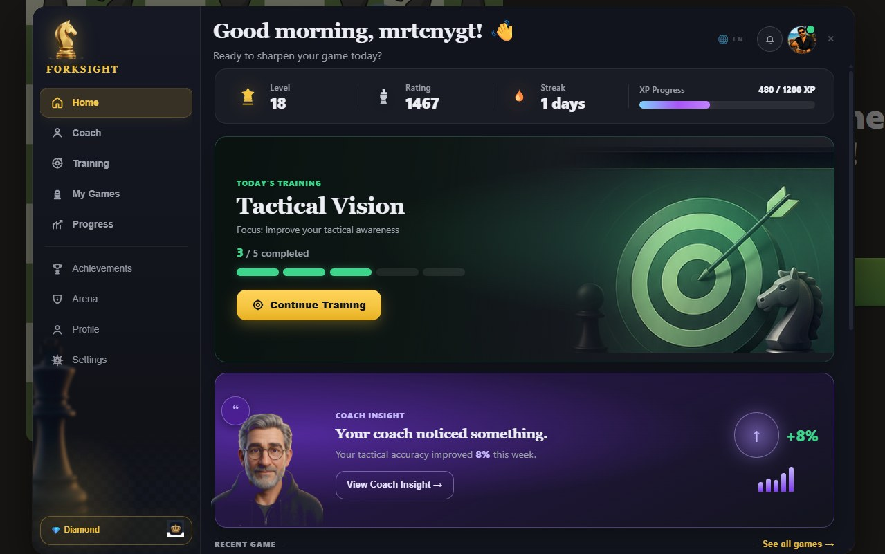
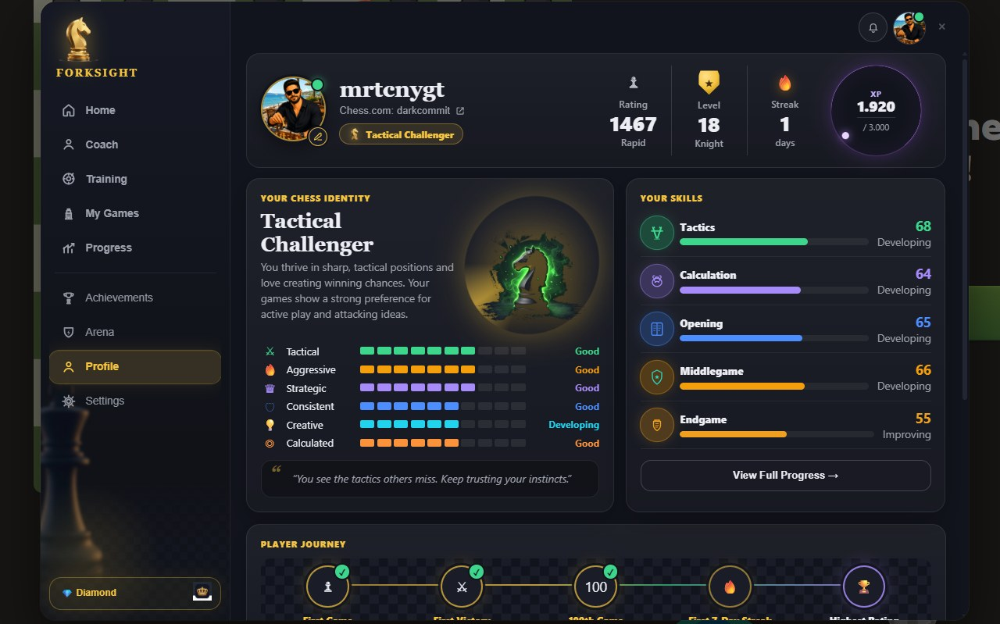
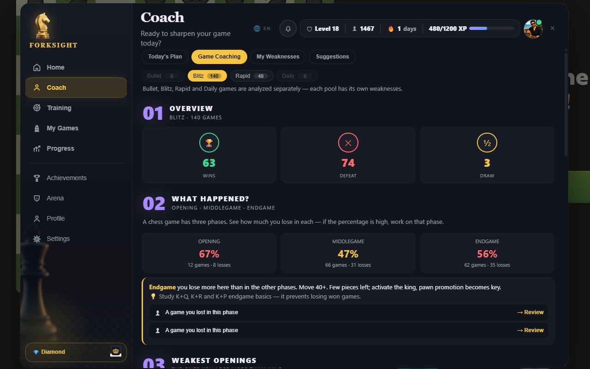
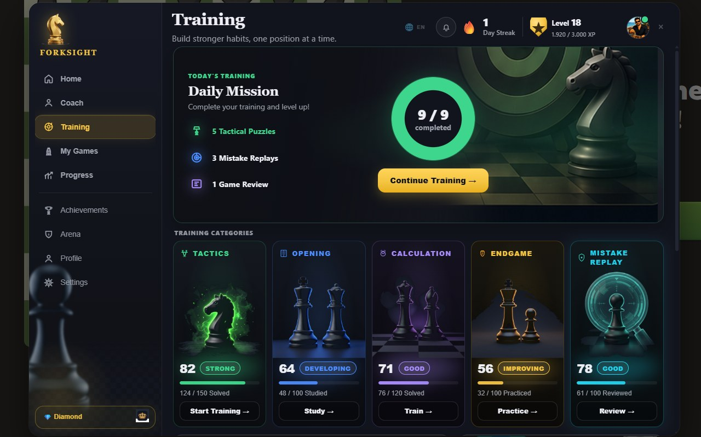
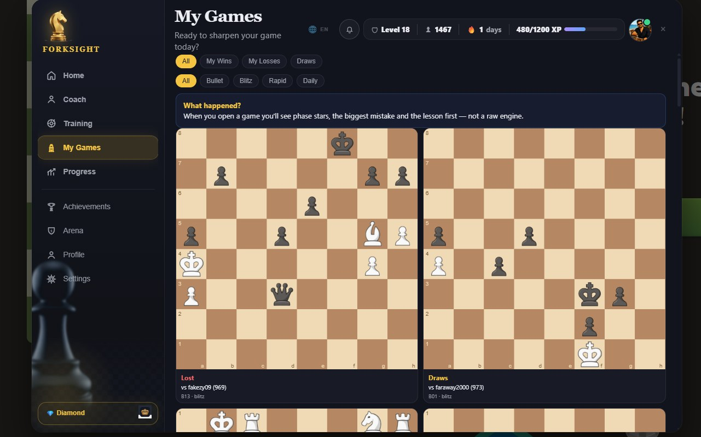
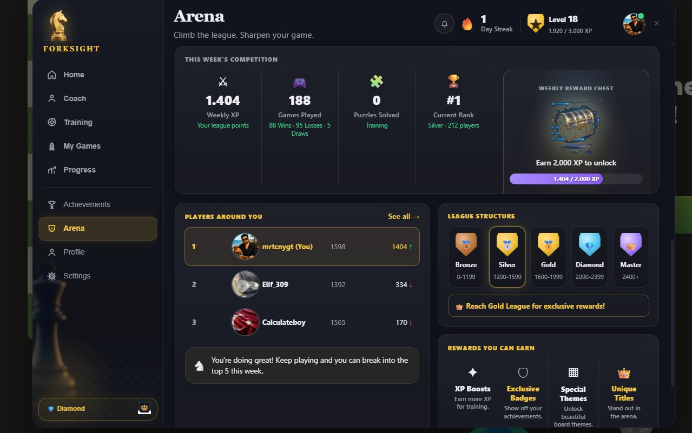

<p align="center">
  
</p>

<h1 align="center">ForkSight</h1>

<p align="center">
  <strong>Your personal chess coach — right on Chess.com.</strong><br/>
  Post-game review · smart puzzles · progress tracking · Arena
</p>

<p align="center">
  <a href="https://chromewebstore.google.com/detail/forksight-%E2%80%94-chess-trainin/nbeldcglpjbmlklbakipohnjcpjmcikd"></a>
  <a href="https://forksight.net"></a>
  <a href="https://forksight.net/premium"></a>
</p>

<p align="center">
  <a href="https://forksight.net">Website</a> ·
  <a href="https://forksight.net/premium">Premium</a> ·
  <a href="https://forksight.net/privacy">Privacy</a> ·
  <a href="https://chromewebstore.google.com/detail/forksight-%E2%80%94-chess-trainin/nbeldcglpjbmlklbakipohnjcpjmcikd">Install</a>
</p>

---

## Why ForkSight?

ForkSight turns finished Chess.com games into a daily training loop: coach review, puzzles from *your* mistakes, profile progress, and competitive Arena leagues.

It never interferes with live play.  
**Not affiliated with, endorsed by, or sponsored by Chess.com.**

## What's new in v3.0

- Redesigned Home, Profile, Coach, Training, My Games, and Arena
- Secure Chess.com account linking with personal verification code
- Onboarding + sync progress for new players
- Stronger puzzle feedback / hint flow
- Updated landing experience on [forksight.net](https://forksight.net)

## Screenshots

<table>
  <tr>
    <td width="50%">
      <p align="center"><strong>Home</strong></p>
      
    </td>
    <td width="50%">
      <p align="center"><strong>Profile</strong></p>
      
    </td>
  </tr>
  <tr>
    <td width="50%">
      <p align="center"><strong>Coach</strong></p>
      
    </td>
    <td width="50%">
      <p align="center"><strong>Training</strong></p>
      
    </td>
  </tr>
  <tr>
    <td width="50%">
      <p align="center"><strong>My Games</strong></p>
      
    </td>
    <td width="50%">
      <p align="center"><strong>Arena</strong></p>
      
    </td>
  </tr>
</table>

## Features

| | |
|---|---|
| **Coach review** | Walk finished games move by move with clear explanations |
| **Smart puzzles** | Practice tactics generated from your own games |
| **My Games** | Browse synced Chess.com games and jump into review |
| **Progress & Profile** | Ratings, streaks, XP, achievements |
| **Arena** | Climb leagues with puzzle performance |
| **Secure linking** | Prove Chess.com ownership via a personal profile code |

## Install

### Chrome Web Store (recommended)

➡️ [Add ForkSight to Chrome](https://chromewebstore.google.com/detail/forksight-%E2%80%94-chess-trainin/nbeldcglpjbmlklbakipohnjcpjmcikd)

### Developer / local

1. Open `chrome://extensions/`
2. Enable **Developer mode**
3. **Load unpacked** → select the [`extension`](extension) folder

## Premium

| Plan | Price | Highlights |
|------|-------|------------|
| **Free** | $0 | Daily puzzles, basic review, profile stats |
| **Gold** | $3 / month · $29 / year | Higher limits, voice coach, deeper engine |
| **Diamond** | $6 / month · $59 / year | Unlimited analysis & hints, priority coaching |

Buy / activate: [forksight.net/premium](https://forksight.net/premium) · [GitHub Sponsors](https://github.com/sponsors/mrtcnygt0)

## Demo

- Coach demo video: [`videos/forksight_coach.mp4`](videos/forksight_coach.mp4)

## Repository

```
extension/     Chrome extension (Manifest V3) — v3.0.0
screenshots/   README & store visuals
videos/        Demo media
docs/          Chrome Web Store listing copy
releases/      GitHub release notes
```

## Support

- Website: https://forksight.net  
- Premium & billing: https://forksight.net/premium  
- Privacy: https://forksight.net/privacy  

---

<p align="center">
  <sub>Made for chess players who improve after the game — not during it.</sub>
</p>
