

  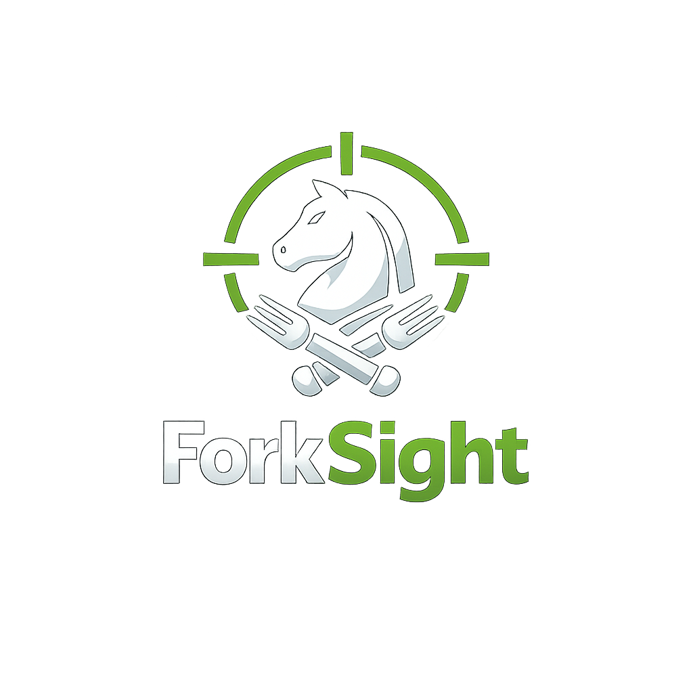

<h1 align="center">ForkSight</h1>

  <strong>The #1 Real-Time Stockfish Extension for Chess.com &amp; Lichess</strong> 
  Cloud-powered analysis · Coach Mode · Phone Companion · Auto-Play · 3 Languages

  
  
  
  
  

  <a href="#-why-forksight">Why ForkSight</a> •
  <a href="#-whats-new-in-v21">What's New</a> •
  <a href="#-features">Features</a> •
  <a href="#-installation">Installation</a> •
  <a href="#-pricing">Pricing</a> •
  <a href="#-screenshots">Screenshots</a> •
  <a href="#-contact">Contact</a>

  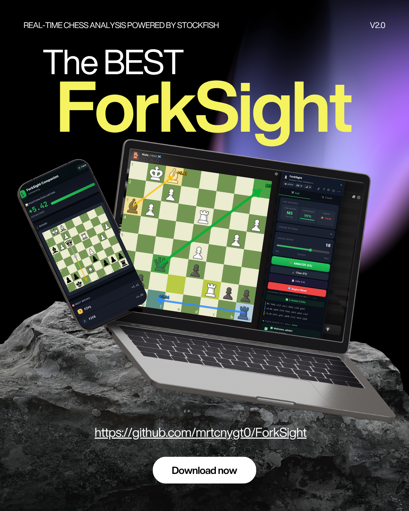

<em>Real-time Stockfish on your screen. A second display in your pocket. <strong>Built for the modern chess player.</strong></em>

---

## 🏆 Why ForkSight?

Most analysis tools make you wait until **after** the game. **ForkSight does it live.**

While you play on Chess.com or Lichess, ForkSight overlays a **professional-grade Stockfish 16+ engine** directly on the board — color-coded arrows, depth-25 evaluation, multi-line variations, instant tactic alerts and a coaching layer that actually teaches you how to think. And in v2.0, we did something **no other extension has ever done**: we put the entire analysis on your **phone**.

> **🥇 We're the most advanced real-time Stockfish extension on the planet — and we plan to keep it that way.**

|                               | Other Extensions   | **ForkSight**                                         |
| ----------------------------- | ------------------ | ----------------------------------------------------- |
| ⚡ **Speed**                  | Post-game analysis | **Live, during the game**                             |
| 🎨 **On-board visualization** | Text-only PGN      | **Color-coded arrows + square highlights**            |
| 🧠 **Engine depth**           | 5–10 (limited)     | **Up to depth 25** with cloud Stockfish 16+           |
| 📊 **Multi-line analysis**    | 1 line             | **Up to 5 best lines simultaneously**                 |
| 🌐 **Platforms**              | One site           | **Chess.com + Lichess.org**                           |
| 📱 **Mobile companion**       | ❌ Not available   | **✅ Phone Companion (v2.0 exclusive)**               |
| 🎓 **Built-in coaching**      | Static evaluation  | **Real-time Coach Mode with tactic detection**        |
| 🤖 **Auto-Play &amp; Anti-Ban**   | ❌ Banned in days  | **Anti-Ban v2: lognormal + ponder + forced + phase-aware**      |
| 🌍 **Languages**              | English only       | **English · Türkçe · Deutsch**                        |
| 🔒 **Stealth & privacy**      | Always-visible UI  | **F4 stealth, end-to-end JWT/HTTPS, zero local data** |

---

## 🚀 What's New in v2.1

<table>
<tr>
<td width="58%">

### 🛡️ Anti-Ban v2 — Insan-Seviyesi Hamle Zamanlaması

v2.1'in odak noktası **Anti-Ban motoru**. Tamamen yeniden tasarlanan zamanlama çekirdeği, Chess.com ve Lichess'in cheat-detection sistemlerinin peşinde olduğu **tüm istatistiksel sinyalleri** gizlemek için geliştirildi.

- ⏱️ **Lognormal düşünme süresi** — Gaussian'ın simetrik kuyruğu yerine gerçek insanlar gibi uzun-kuyruklu dağılım.
- 🧠 **Ponder-hit tespiti** — rakip beklenen hattı oynadıysa cevap **0.4–1s** içinde gelir (insan refleksi).
- 💡 **Forced-move algoritması** — tek yasal hamle / büyük materyal uçurumlarında 0.2–0.7s.
- 🎯 **Kritik pozisyon dedektörü** — mat tehdidi ya da birden çok eşdeğer hamlede **2.6×** uzun düşünme.
- 😲 **Surprise reaction** — rakip beklenmedik bir şey oynadığında otomatik **+0.8–2.0s** ek düşünme.
- 🏗️ **Materyal-bazlı oyun fazı** — hamle sayısı yerine tahtadaki taşlardan açılış / orta oyun / son oyun ayırt edilir; endgame'de teknik hızlı oyun.
- 🔗 **Auto-correlated think-time** — ardışık hamleler arası doğal süre korelasyonu (insan ritmi).
- 🕰️ **Time-budget farkındalığı** — kalan süre + beklenen hamle sayısına göre bir hamleye ayırılan bütçe.

> Sonuç: CAPS2 ve move-time variance dedektörlerinin ayıklamak için tasarlandığı "engine pattern" artık yok.

</td>
<td width="42%" align="center">
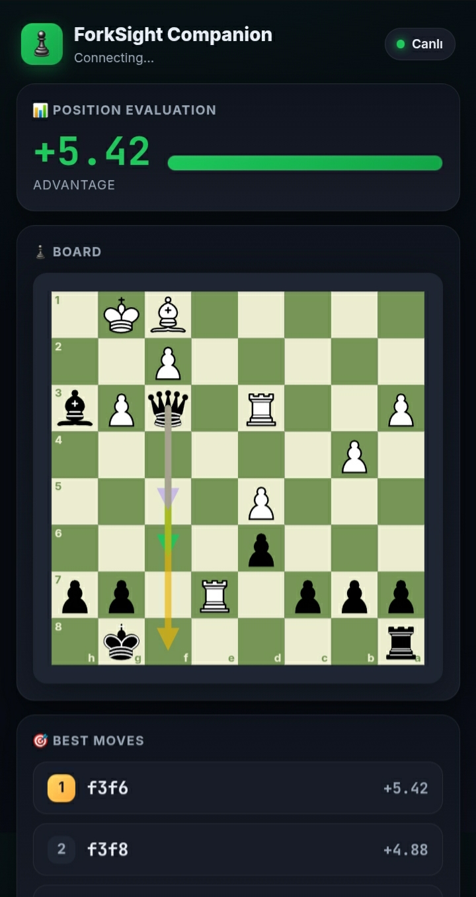 
<em>Anti-Ban v2 — Lognormal + Ponder + Forced + Phase-aware timing.</em>
</td>
</tr>
</table>

### Plus across v2.1:

- 📊 **Admin panel üst kullanıcılar paneli** — toplam analiz / oyun / ortalama derinlik istatistikleri ile satıra tıklayarak detay.
- 🎮 **Oyun ID sütunu** — admin günlüklerinde artık her oyun doğrudan Chess.com / Lichess linkine bağlanır.
- 📢 **Bildirim canlı önizleme** — yeni bildirim oluştururken gerçek görüntü anlık görünür; görüntülenme / tıklanma istatistikleri ve CTR badge'leri.
- 🔑 **Server v3.1.x** — v2.0 minimum sürüm zorlaması korundu; v2.1 ile geriye-uyumlu.
- 📝 **3 dil i18n parite** — EN / TR / DE "About" metni v2.1'e güncellendi.

---

## 🚀 What's New in v2.0

<table>
<tr>
<td width="58%">

### 📡 Phone Companion — Streamer Edition

**The flagship v2.0 feature.** Mirror your entire ForkSight panel to a **second screen in your pocket**, in real time, over an encrypted WebSocket session.

- 🔐 **PIN-secured pairing** — scan the QR code on your phone, enter the 4-digit code, you're in. No accounts, no Bluetooth, no setup.
- 📱 **Pixel-perfect mobile UI** — board, eval bar, best moves, depth, MultiPV, mode selector — everything mirrored.
- 🎚️ **Remote control** — change depth, MultiPV, auto-analysis and play mode **from your phone**.
- 🌍 **Language sync** — your phone speaks the same language as your panel (EN/TR/DE), automatically.
- 🟢 **Live status** — pulsing connection indicator, instant "PC offline" overlay with auto-reconnect.
- 🔒 **Truly private** — only your phone session ID can connect. Sessions expire when the extension closes.

> Perfect for **streamers**, **OTB study**, **tournament prep**, or just keeping your second monitor clean.

</td>
<td width="42%" align="center">
 
<em>Companion running on a phone — board, eval, best moves, all live.</em>
</td>
</tr>
</table>

### Plus across v2.0:

- 🎯 **Auto-Play promotion fix** — promotion menus now resolve reliably on Chess.com & Lichess.
- 🎨 **Redesigned UI** — cleaner buttons, status dots, smoother animations, polished modals.
- 💎 **New Streamer membership tier** — unlocks Phone Companion ($5/mo or $33 lifetime).
- 🌐 **Full i18n parity** — EN / TR / DE across the panel, popup and the new mobile companion.
- ⚡ **Stability & performance** — faster boot, fewer reconnects, hardened WebSocket layer.

---

## ✨ Features

<table>
<tr>
<td width="50%">

### 🔍 **Smart Real-Time Analysis**

- **Stockfish 16+** on dedicated cloud servers
- Adjustable **depth (5–25)**
- **Multi-PV** up to **5 best lines**
- Color-coded arrows: best / great / good / inaccurate
- Source &amp; destination square highlights

</td>
<td width="50%">

### 🎮 **Native Board Integration**

- Seamless overlay on **Chess.com &amp; Lichess**
- Automatic board detection &amp; orientation
- Works with **all time controls**
- Keyboard shortcuts: **F2** analyze · **F3** clear · **F4** stealth
- **Draggable, minimizable** floating panel

</td>
</tr>
<tr>
<td>

### 🎓 **Coach Mode**

- Live **eval bar** (your perspective)
- **Move quality** feedback after every move
- **Missed move** highlights on the board
- **Tactic detection** without spoiling the answer
- **Hint system** — 5 hints per game

</td>
<td>

### 📡 **Phone Companion** _(v2.0)_

- Mirror panel to your phone via QR + PIN
- **Remote control** depth, MultiPV, mode
- **Auto language sync** (EN/TR/DE)
- Encrypted **WebSocket** session
- Auto-reconnect on dropouts

</td>
</tr>
<tr>
<td>

### 🤖 **Auto-Play &amp; Anti-Ban v2**

- Plays the **best move** automatically
- **Lognormal** human think-time distribution
- **Ponder-hit / forced / critical / surprise** detection
- **Material-based** game-phase modulation
- **Auto-correlated** think-time (no robotic rhythm)
- **Opening book** (15-position weighted)
- **Elo ceiling** — simulate 800–2800
- **Auto-Match** queue (10m → unlimited)

</td>
<td>

### 🌐 **Multi-Language &amp; Privacy**

- 🇬🇧 English · 🇹🇷 Türkçe · 🇩🇪 Deutsch
- Switch language **on the fly**
- Full **HTTPS + JWT** authentication
- **No data stored** on your device
- **F4 stealth mode** — instant hide

</td>
</tr>
</table>

---

## 📦 Installation

### Step 1 — Download

Grab the latest release from the [**Releases**](../../releases) page:

- 📥 `ForkSight-Chess.com-v2.1.zip` — for **Chess.com**
- 📥 `ForkSight-Lichess-v2.1.zip` — for **Lichess.org**

### Step 2 — Install in Chrome / Edge / Brave

1. **Unzip** the downloaded file
2. Open `chrome://extensions/`
3. Enable **Developer Mode** (top-right toggle)
4. Click **Load unpacked**
5. Select the unzipped extension folder
6. The ForkSight icon appears in your toolbar ✅

### Step 3 — Start Playing

1. Open [chess.com](https://www.chess.com) or [lichess.org](https://lichess.org)
2. The ForkSight panel slides in automatically
3. **Free users** — Log in as **Guest** and start analyzing
4. **Premium / Streamer** — Log in for full unlocks &amp; the Phone Companion

---

## 💎 Pricing

<table>
<thead>
<tr>
<th align="left">Feature</th>
<th align="center">🆓 Free</th>
<th align="center">💎 Premium</th>
<th align="center">📡 Streamer</th>
</tr>
</thead>
<tbody>
<tr><td>Manual Analysis (F2)</td><td align="center">✅</td><td align="center">✅</td><td align="center">✅</td></tr>
<tr><td>Color-Coded Arrows</td><td align="center">✅</td><td align="center">✅</td><td align="center">✅</td></tr>
<tr><td>Chess.com + Lichess</td><td align="center">✅</td><td align="center">✅</td><td align="center">✅</td></tr>
<tr><td>Multi-Language (EN/TR/DE)</td><td align="center">✅</td><td align="center">✅</td><td align="center">✅</td></tr>
<tr><td>Coach Mode</td><td align="center">✅</td><td align="center">✅</td><td align="center">✅</td></tr>
<tr><td>Stealth Mode (F4)</td><td align="center">✅</td><td align="center">✅</td><td align="center">✅</td></tr>
<tr><td>Analysis Depth</td><td align="center">Max <strong>8</strong></td><td align="center">Max <strong>25</strong></td><td align="center">Max <strong>25</strong></td></tr>
<tr><td>Multi-PV (Best Lines)</td><td align="center"><strong>1</strong></td><td align="center">Up to <strong>5</strong></td><td align="center">Up to <strong>5</strong></td></tr>
<tr><td><strong>Auto Analysis</strong></td><td align="center">❌</td><td align="center">✅</td><td align="center">✅</td></tr>
<tr><td><strong>Auto Play</strong></td><td align="center">❌</td><td align="center">✅</td><td align="center">✅</td></tr>
<tr><td>Anti-Ban / Human Timing</td><td align="center">❌</td><td align="center">✅</td><td align="center">✅</td></tr>
<tr><td>Opening Book</td><td align="center">❌</td><td align="center">✅</td><td align="center">✅</td></tr>
<tr><td>Elo Ceiling (800–2800)</td><td align="center">❌</td><td align="center">✅</td><td align="center">✅</td></tr>
<tr><td>Auto Match Queue</td><td align="center">❌</td><td align="center">✅</td><td align="center">✅</td></tr>
<tr><td>WebSocket Streaming</td><td align="center">❌</td><td align="center">✅</td><td align="center">✅</td></tr>
<tr><td>Engine Reset</td><td align="center">❌</td><td align="center">✅</td><td align="center">✅</td></tr>
<tr><td>📡 <strong>Phone Companion</strong></td><td align="center">❌</td><td align="center">❌</td><td align="center">✅</td></tr>
<tr><td>📡 <strong>Remote Mobile Control</strong></td><td align="center">❌</td><td align="center">❌</td><td align="center">✅</td></tr>
<tr><td>Priority Support</td><td align="center">❌</td><td align="center">✅</td><td align="center">✅</td></tr>
</tbody>
</table>

### 🪙 Plans

<table>
<thead>
<tr>
  <th align="left">Plan</th>
  <th align="center">Monthly</th>
  <th align="center">Lifetime</th>
  <th align="left">What you get</th>
</tr>
</thead>
<tbody>
<tr>
  <td>💎 <strong>Premium</strong></td>
  <td align="center"><strong>$2.99/mo</strong></td>
  <td align="center"><strong>$19.99</strong></td>
  <td>Auto Analysis, Auto Play, Anti-Ban, Opening Book, Elo Ceiling, Auto-Match, depth 25, 5 lines, WebSocket</td>
</tr>
<tr>
  <td>📡 <strong>Streamer</strong></td>
  <td align="center"><strong>$5/mo</strong></td>
  <td align="center"><strong>$33</strong></td>
  <td>Everything in Premium <strong>+ Phone Companion</strong> (mirror panel to phone, remote control from mobile, encrypted PIN session)</td>
</tr>
</tbody>
</table>

  
  &nbsp;
  

> 🔑 After sponsoring, send your **ForkSight username** to [mertcanyigit54@outlook.com](mailto:mertcanyigit54@outlook.com). Your account is upgraded **within 24 hours**.

---

## 📸 Screenshots

  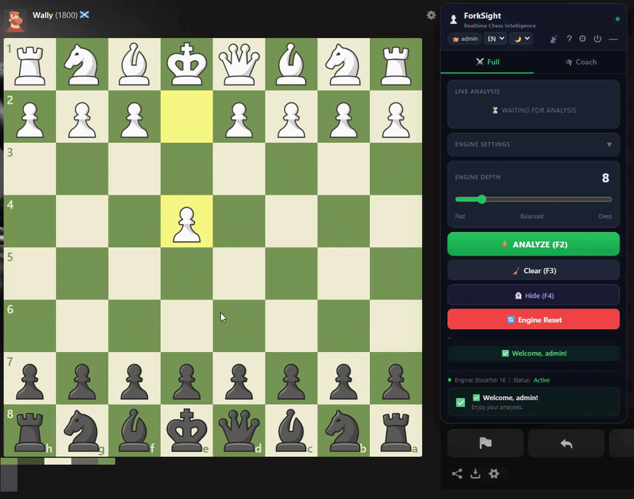 
  <strong>Live Gameplay</strong> — depth-25 Stockfish, real-time arrows, zero lag

### Desktop Panel

<table>
<tr>
<td align="center" width="50%">
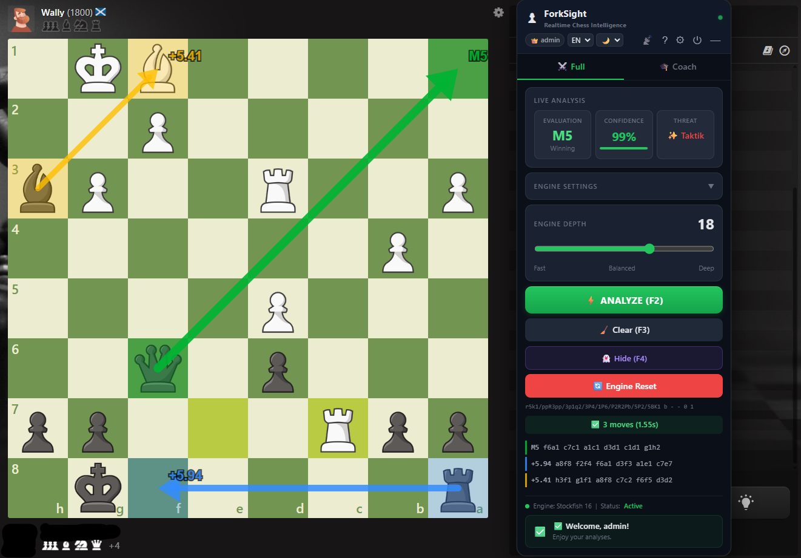 
<strong>Analysis Panel</strong> 
<em>Real-time Stockfish overlay with color-coded arrows</em>
</td>
<td align="center" width="50%">
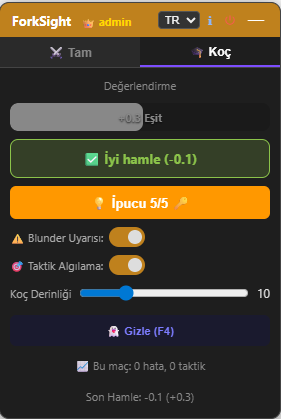 
<strong>Coach Mode</strong> 
<em>Eval bar, move quality, tactic detection &amp; game stats</em>
</td>
</tr>
<tr>
<td align="center">
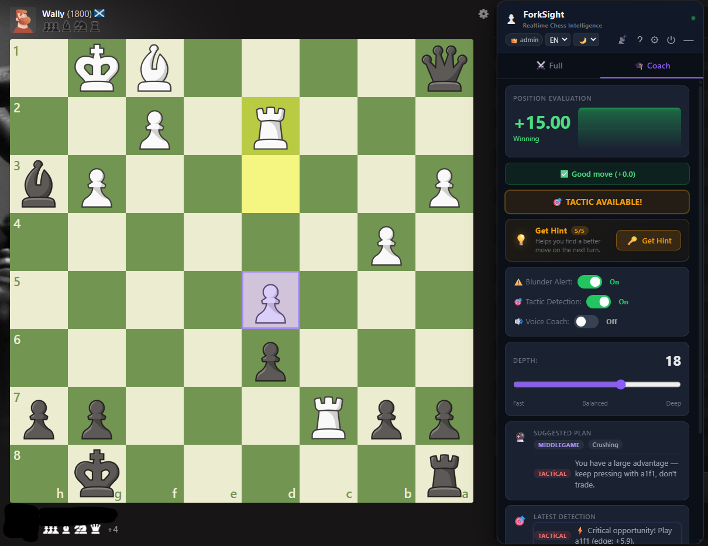 
<strong>Move Quality Feedback</strong> 
<em>Instant verdicts after every single move</em>
</td>
<td align="center">
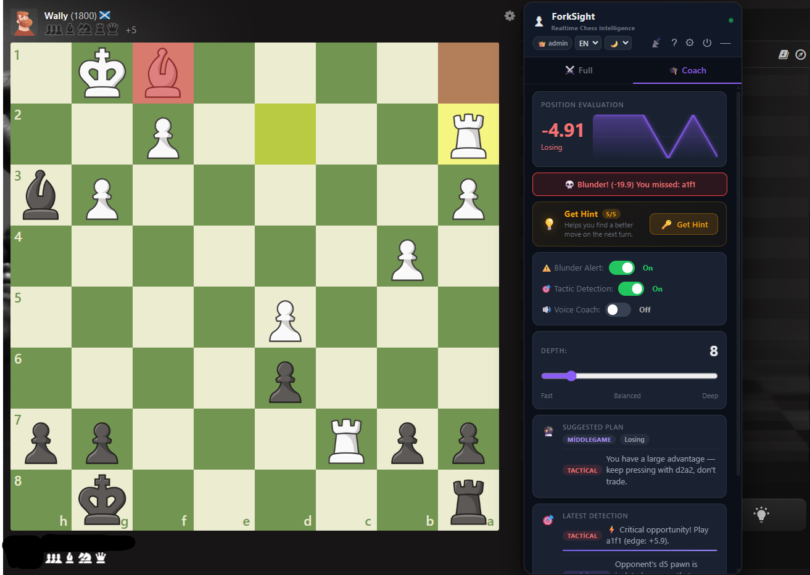 
<strong>Blunder &amp; Missed Move</strong> 
<em>Red highlights show the move you should have played</em>
</td>
</tr>
<tr>
<td align="center">
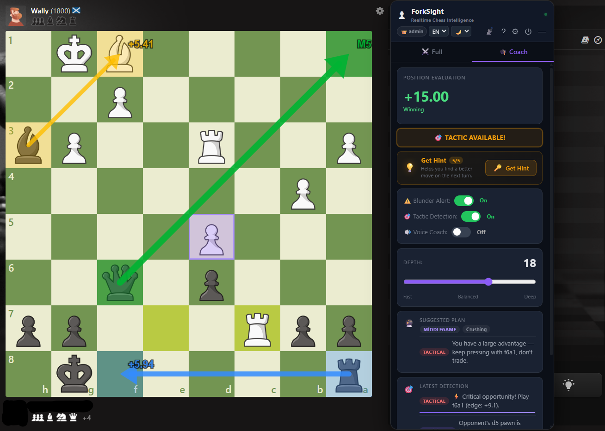 
<strong>Tactic Detection</strong> 
<em>"There's a tactic here" — without spoiling the move</em>
</td>
<td align="center">
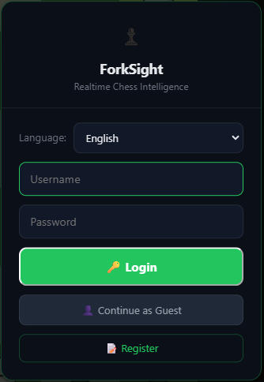 
<strong>Secure Login</strong> 
<em>JWT-based auth with one-click guest mode</em>
</td>
</tr>
</table>

### 📡 Phone Companion _(Streamer)_

<table>
<tr>
<td align="center" width="35%">
 
<strong>Mobile Mirror</strong> 
<em>Full board, eval, best moves &amp; remote settings</em>
</td>
<td width="65%">

**How it works:**

1. Click the **📡 Streamer** button in the panel
2. A **QR code + PIN** appears on your desktop
3. Scan the QR with your phone — open the link
4. Enter the **4-digit PIN** — connected ✅
5. The companion mirrors **everything** in real time
6. Change depth, MultiPV, mode — **from your phone**

**Why it matters:**

- Keep your main screen **clean** during streaming
- Use your phone as a **second board** while playing OTB
- Study a position from across the room
- **Auto language sync** — your phone matches your panel locale instantly

</td>
</tr>
</table>

### Popup &amp; About

<table>
<tr>
<td align="center" width="50%">
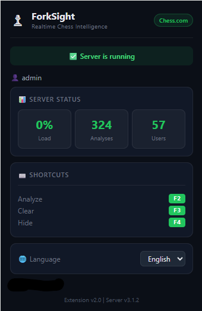 
<strong>Extension Popup</strong> 
<em>Status, account info &amp; quick actions</em>
</td>
<td align="center" width="50%">
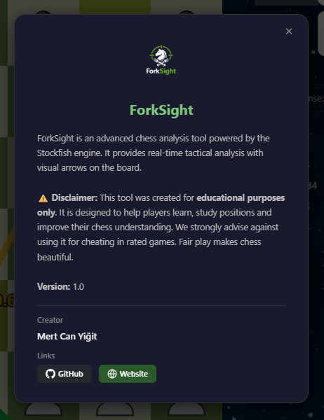 
<strong>About Dialog</strong> 
<em>Version info, language switcher &amp; credits</em>
</td>
</tr>
</table>

---

## ⌨️ Keyboard Shortcuts

| Shortcut | Action                           |
| -------- | -------------------------------- |
| `F2`     | Analyze current position         |
| `F3`     | Clear arrows and analysis        |
| `F4`     | Toggle stealth mode (hide panel) |

---

## 🌍 Supported Platforms

| Platform                                                                                                                                                                                                                                                                                                                                                                                                                                    | Status             | Extension folder     |
| ------------------------------------------------------------------------------------------------------------------------------------------------------------------------------------------------------------------------------------------------------------------------------------------------------------------------------------------------------------------------------------------------------------------------------------------- | ------------------ | -------------------- |
|  | ✅ Fully Supported | `extension/`         |
|                                                                                                                                                                                                                                                                                                                                  | ✅ Fully Supported | `lichess-extension/` |

---

## 💖 Support the Project

  

ForkSight is built and maintained by **a single developer**. Running cloud servers, the Stockfish engine and the WebSocket / companion infrastructure 24/7 takes real money. **Your sponsorships keep this project alive.**

If ForkSight makes your chess better — even a little — please consider supporting the project:

  

**Where your money goes:**

- ☁️ Cloud server costs (24/7 Stockfish + companion infrastructure)
- 🔧 New features (Phone Companion was your request — keep them coming!)
- 🐛 Bug fixes &amp; platform compatibility (Chess.com / Lichess change often)
- 🌍 More language translations
- 📱 Future Firefox &amp; native mobile clients

---

## 📬 Contact

| Channel        | Link                                                                   |
| -------------- | ---------------------------------------------------------------------- |
| 📧 **Email**   | [mertcanyigit54@outlook.com](mailto:mertcanyigit54@outlook.com)        |
| 🌐 **Website** | [mertcanyigit.com](https://mertcanyigit.com)                           |
| 🐙 **GitHub**  | [github.com/mrtcnygt0](https://github.com/mrtcnygt0)                   |
| 💎 **Sponsor** | [github.com/sponsors/mrtcnygt0](https://github.com/sponsors/mrtcnygt0) |

---

## ⚖️ License

**© 2026 Mert Can Yiğit. All Rights Reserved.**

This software is proprietary and protected by copyright law. See the [LICENSE](LICENSE) file for full details.

> ⛔ **You may NOT** modify, redistribute, reverse-engineer, or create derivative works from this software.
>
> ✅ **You MAY** use ForkSight for personal, educational purposes within the terms of the license.

---

## ⚠️ Disclaimer

ForkSight is an **educational tool** designed for studying chess positions and improving your understanding of the game. The developers do not encourage or condone the use of this software for cheating in online rated games. Use of this tool in violation of any platform's terms of service is solely the user's responsibility.

---

  

  
   
  <strong>ForkSight</strong> — See every fork. Seize every tactic.
   
  Made with ♟️ by <a href="https://mertcanyigit.com">Mert Can Yiğit</a>

